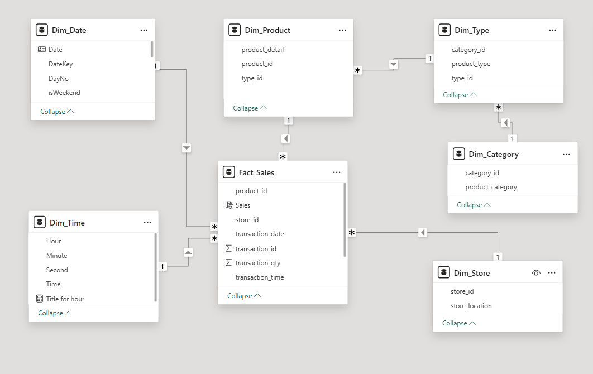

# Data Modelling

## Star Schema Structure

In this project, I used a **star schema structure** to organize the data for efficient querying and analysis.

### Fact Table: `Fact_Sales`

- **`transaction_id`**: The primary key (PK) for the fact table, uniquely identifying each transaction.
- **`product_id`**: A foreign key (FK) linking to the `Dim_Product` dimension table, identifying the product involved in the transaction.
- **`store_id`**: A foreign key (FK) linking to the `Dim_Store` dimension table, identifying the store where the transaction occurred.
- **`transaction_date`**: The date of the transaction.
- **`transaction_time`**: The time of the transaction.
- **`transaction_qty`**: The quantity of products purchased.
- **`unit_price`**: The price per unit of the product.
- **`sales`**: The total sales amount for the transaction.

### Dimension Tables

Each dimension table has a **many-to-one relationship** with the fact table, meaning multiple records in the fact table can relate to a single record in a dimension table.

#### `Dim_Product`

- **`product_id`**: The primary key (PK) that uniquely identifies each product.
- **`product_detail`**: Detailed description of the product.
- **`type_id`**: A foreign key (FK) linking to the `Dim_Type` dimension table, identifying the type of the product.

#### `Dim_Store`

- **`store_id`**: The primary key (PK) that uniquely identifies each store.
- **`store_location`**: The location of the store.

#### `Dim_Type`

- **`type_id`**: The primary key (PK) that uniquely identifies each product type.
- **`product_type`**: The type of the product (e.g., *Brewed*, *Barista Espresso*).
- **`category_id`**: A foreign key (FK) linking to the `Dim_Category` dimension table, identifying the category of the product.

#### `Dim_Category`

- **`category_id`**: The primary key (PK) that uniquely identifies each product category.
- **`product_category`**: The category of the product (e.g., *Coffee*, *Tea*).

#### `Dim_Date`

- **`DateKey`**: The primary key (PK) that uniquely identifies each date.
- **`Date`**: The date.
- **`DayNo`**: The day number.
- **`inWeekend`**: Indicates if the date is a weekend.

#### `Dim_Time`

- **`Time`**: The primary key (PK) that uniquely identifies each time.
- **`Hour`**: The hour.
- **`Minute`**: The minute.
- **`Second`**: The second.

---

## Database and Tables Creation

I designed and implemented the database in **MySQL**, where I created each table (fact and dimension) based on the schema defined above. The creation process involved:

1. **Defining the Tables**:  
   - Used SQL scripts to create the `Fact_Sales`, `Dim_Product`, `Dim_Store`, `Dim_Type`, `Dim_Category`, `Dim_Date`, and `Dim_Time` tables.  
   - Specified the appropriate data types and constraints (e.g., primary keys, foreign keys, `NOT NULL`).

2. **Establishing Relationships**:  
   - Set up foreign key constraints to enforce referential integrity between the fact and dimension tables.

The SQL script used for this process is available here: [`db_creation_coffee_sales.sql`](db_creation_coffee_sales.sql).

---

## Data Loading

Once the tables were created, I proceeded to load the data into the database.

1. **Data Import**:  
   - Imported the raw data (transformed during the **Data Preparation** phase) into the MySQL database using SQL commands.  
   - Ensured the data was correctly mapped to the corresponding columns in the tables.

2. **Data Integrity**:  
   - For columns with empty string records (identified during the **Data Preparation** phase), I converted those to `NULL` values to accurately represent missing data.

The SQL script for data loading can also be found here: [`db_creation_coffee_sales.sql`](db_creation_coffee_sales.sql).

---

## Entity-Relationship Diagram (ERD)

The following **Entity-Relationship Diagram (ERD)** visually represents the star schema structure, providing a clear overview of the database architecture and the relationships between entities.

 <!-- Replace with the actual path to your ERD image -->
