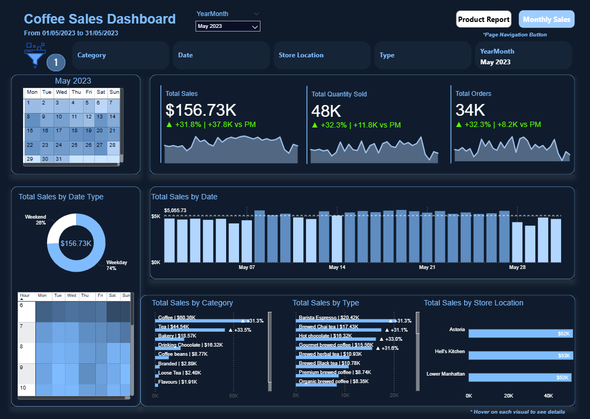
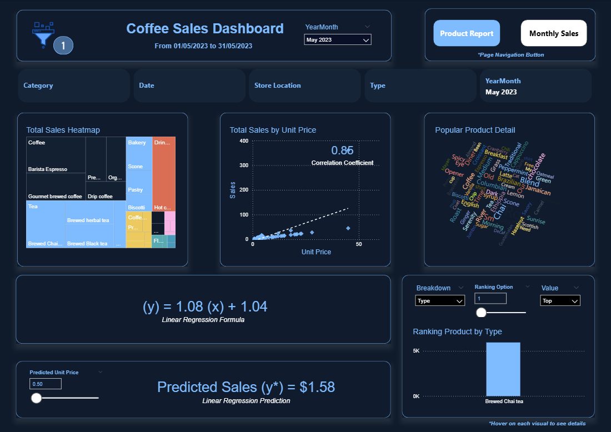

# ☕ Coffee Shop Sales Data Project

📊 A complete walkthrough of transforming, modeling, analyzing, and reporting on coffee shop transaction data.

---

## 📁 Table of Contents
- 🔧 Data Preparation and Analysis
- 🔍 Data Cleaning
- 🔀 Data Extraction and Transformation
- 🧱 Data Modeling
- 📈 Sales Data Analysis  
- 📋 Report Creation 

---

## 🔧 Data Preparation and Analysis

### 🧐 Data Examination
**Dataset Fields:**
- 🆔 `transaction_id`
- 📅 `transaction_date`, ⏰ `transaction_time`
- 📦 `transaction_qty`
- 🏬 `store_id`, `store_location`
- 🛍️ `product_id`, `unit_price`
- 🧃 `product_category`, `product_type`, `product_detail`

### 🔄 Data Transformation
- 🆔 **Add Unique IDs** to transactions, products, and stores  
- 🗂️ **Create Mapping Dictionaries** for products and stores  
- ✅ **Validate Consistency** across lookup tables and raw data  
- ✍️ **Correct Misspellings** in product/store details  
- 🔁 **Replace Descriptions with IDs** for standardization  
- 💾 **Save Structured Data** for downstream use

### ⚠️ Data Quality Issues
- ❌ Missing values (e.g., `product_detail`)  
- 🧾 Inconsistent time formatting  
- 🧯 Duplicate transactions

### ⏭️ Next Steps
- 🧼 Data cleaning  
- 🔗 Dataset integration (e.g., customers, inventory)  
- 🔍 Exploratory Data Analysis (EDA)

---

## 🧱 Data Modeling

### ⭐ Star Schema Structure

**🗄️ Fact Table – `Fact_Sales`:**
- `transaction_id` (PK)
- `product_id` (FK)
- `store_id` (FK)
- `transaction_date`, `transaction_time`
- `transaction_qty`
- `unit_price`, `sales` (calculated)

**📊 Dimension Tables:**
- `Dim_Product`: `product_id`, `product_detail`, `type_id`  
- `Dim_Store`: `store_id`, `store_location`  
- `Dim_Type`: `type_id`, `product_type`, `category_id`  
- `Dim_Category`: `category_id`, `product_category`  
- `Dim_Date`: `DateKey`, `Date`, `DayNo`, `inWeekend`  
- `Dim_Time`: `Time`, `Hour`, `Minute`, `Second`

### 📥 Data Loading
- ✅ Ensured correct column mapping  
- 🚫 Converted empty strings → `NULL`

---

## 📈 Sales Data Analysis

### 🔢 Summary Stats
- **Total Transactions**: 2703  
- **Total Units Sold**: 4190  
- **Total Revenue**: `$13,090.05`

### 🏪 Store Performance
| Store           | Transactions | Units Sold | Revenue     |
|----------------|--------------|------------|-------------|
| Lower Manhattan| 1000         | 1558       | $4,869.95   |
| Hell's Kitchen | 830          | 1288       | $4,028.55   |
| Astoria        | 873          | 1344       | $4,191.55   |

### 📦 Product Category Performance
| Category            | Transactions | Units | Revenue     |
|---------------------|--------------|-------|-------------|
| Coffee              | 1300         | 2000  | $6,250.00   |
| Tea                 | 900          | 1400  | $4,375.00   |
| Bakery              | 300          | 450   | $1,406.25   |
| Drinking Chocolate  | 150          | 225   | $703.13     |
| Flavours            | 2            | 3     | $2.40       |
| Loose Tea           | 1            | 1     | $8.95       |

### 🏆 Top Products (Quantity Sold)
1. Drip Coffee – 400  
2. Barista Espresso – 380  
3. Gourmet Brewed Coffee – 350  
4. Brewed Chai Tea – 320  
5. Organic Brewed Coffee – 300  
6. Premium Brewed Coffee – 280  
7. Brewed Herbal Tea – 250  
8. Brewed Black Tea – 220  
9. Hot Chocolate – 200  
10. Brewed Green Tea – 180

### 💰 Top Products (Revenue)
1. Barista Espresso – $1,425.00  
2. Gourmet Brewed Coffee – $1,050.00  
3. Drip Coffee – $1,000.00  
4. Brewed Chai Tea – $992.00  
5. Organic Brewed Coffee – $900.00  

### ⚖️ Average Unit Price by Category
- Coffee: $3.12  
- Tea: $3.13  
- Bakery: $3.13  
- Drinking Chocolate: $3.13  
- Flavours: $0.80  
- Loose Tea: $8.95

### 📊 Quantity per Transaction
- **Min**: 1 unit  
- **Max**: 2 units  
- **Average**: 1.55 units

### 📅 First Week of January (Daily Volume)
- Jan 1: 550  
- Jan 2: 450  
- Jan 3: 400  
- Jan 4: 380  
- Jan 5: 350  
- Jan 6: 320  
- Jan 7: 253 (partial)

---

## 📋 Report Creation

### 📌 Overview Page
- **Key Metrics**: Revenue, Opportunities, Success Rate, Sales Cycle Days  
- **Revenue Trends**: Line/bar chart by month/quarter  
- **Opportunity Funnel**: Stacked bar chart (Won, Lost, Engaging, Prospecting)  
- **Top Products/Accounts**: Ranked by revenue  
- **Sales by Region**: Bar chart or map

### 📦 Products Page
- Top Selling / Fastest Selling / High Success Products  
- Revenue by Product Series  
- Success Rate vs Series Avg  
- Sales Cycle vs Series Avg  
- Price Difference vs RRP

### 🌍 Market Reach
- Top Accounts, Sectors, Countries  
- Success Rate & Revenue by Sector  
- Sales Cycle by Sector  
- Client-Level Table: Revenue, Top Products, Countries

### 👥 Sales Teams
- Top Managers (by revenue)  
- Best & Worst Agents  
- Regional Office Performance
- Detailed Metrics by Manager/Agent
- 🎯 **Promotional Impact Analysis**  
- 📦 **Inventory Optimization**

---

